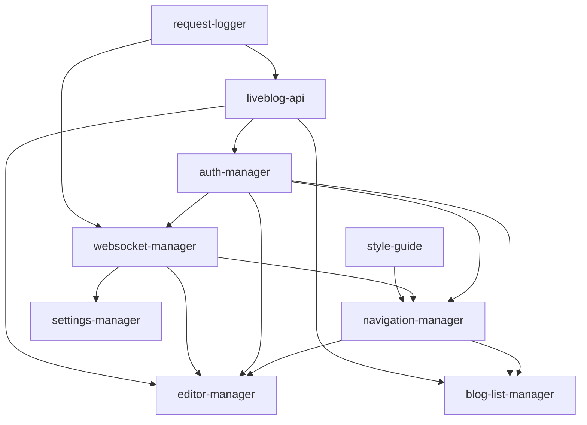

# client_web2 — Knowledge Graph

**Updated:** 2026-05-27 (blogging UX, rich text editor, documentation sweep)

## Project

| Key | Value |
|-----|-------|
| Path | `client_web2/` |
| Plans | `client_web2/plans/` |
| Legacy | `client/` (AngularJS — legacy branch / host-only) |
| Dev URL | http://localhost:9000 (Docker compose + `npm run dev`) |
| API | http://localhost:5000/api (Vite proxy `/api`, `/embed`, `/themes_assets`, `/themes_uploads`) |
| WebSocket | ws://localhost:5100 |
| Stack | React 19, Vite 6, Tailwind 4, TS 5.8, TanStack Query 5 |

## Mechanism dependency graph

## Legacy → web2 mapping

| Legacy (`client/app/scripts/`) | Mechanism | Phase |
|-------------------------------|-----------|-------|
| Superdesk auth | auth-manager | 1 |
| Superdesk users profile (`#/profile/`) | auth-manager | 2 — ProfilePage |
| Superdesk users admin | user-manager | 1 — `/users` |
| Superdesk notification / WebSocketProxy | websocket-manager | 1 — done |
| menu notifications pane (`activity` API) | navigation-manager | 2 — done |
| menu / shell | navigation-manager | 1 |
| liveblog-bloglist | blog-list-manager | 2 |
| liveblog-edit | editor-manager | 3 |
| liveblog-settings | settings-manager | 5 — done |
| liveblog-themes | themes-manager | 5 — done (stylesTab Phase 5+) |
| liveblog-analytics | analytics-manager | 6 |
| liveblog-syndication | syndication-manager | 6 |
| liveblog-marketplace | marketplace-manager | 6 |
| liveblog-advertising | advertising-manager | 6 |
| liveblog-freetypes | freetypes-manager | 6 |

## Design tokens (Maroela)

Source: `src/index.css` `@theme`, aligned with `client/app/styles/tailwind/portal.css`

| Token | Value |
|-------|-------|
| page | `#f5efe7` |
| teal | `#157578` |
| orange | `#c45712` |
| font | Lato |

## Embed theme: Tribute (2026-05-26)

Server asset path: `server/liveblog/themes/themes_assets/tribute/` (`theme.json`, `template.html`, `less/tribute.less` → `dist/tribute.css`). Registered via `system_themes` + `manage.py register_local_themes`. Docker dev: `docker-compose.yml` mounts `system_themes.py` and `themes_assets/tribute`.

| Token | Value |
|-------|-------|
| parchment | `#f6f2ea` |
| ink | `#12141a` |
| gold | `#9a7224` / `#c9a227` |
| crimson (highlight) | `#8b2942` |
| fonts | Fraunces (display) + DM Sans (UI) |
| measure | ~44rem centered column |

Preview: `/embed/<blogId>/theme/tribute` or `/theme/tribute-light` (requires theme registered in Mongo).

**Tribute Light** (`themes_assets/tribute-light/`): same layout as Tribute; canvas `#faf9f7`, white cards, frosted white toolbar (not ink bar), honey gold `#a67c2a`, class `tribute-light-timeline`. Brand SVGs live under `images/`; template icons (`action_link.svg`, `pinpost.svg`, …) use parent **`assets_root`** (`/themes_assets/default/`) unless the child ships a full `images/` set (marker: `action_link.svg`). Server: `ThemesService.get_theme_assets_root` (2026-05-27).

## Status

Phase 0 complete — all 15 mechanism READMEs elaborated. **Foundation Phase 1:** navigation shell. **Phase 2:** blog-list. **Phase 3–4:** editor. **Phase 5:** settings + themes. **Phase 6:** analytics, freetypes, advertising, marketplace, syndication. **websocket-manager (2026-05-26):** Phase 1–2 done. **editor-manager (2026-05-27):** Schedule, edit/cancel, unpublish, image block, freetype composer, Scorecard builtin, **rich-text-editor** subsystem (Maroela `contentEditable` toolbar, HTML in `item.text`). **blog-list-manager (2026-05-27):** Server search, pagination, access-request modal, WS blog refresh. **editor-manager (2026-05-26):** `EditorViewMode` + `BlogLivePreviewPane`.

## Routes (Phase 5)

| Path | Mechanism |
|------|-----------|
| `/settings/general` | settings-manager |
| `/settings/instance-settings` | settings-manager |
| `/themes` | themes-manager |
| `/users` | user-manager |

## Implemented paths

| Mechanism | Source |
|-----------|--------|
| request-logger | `src/mechanisms/request-logger/` |
| liveblog-api | `src/mechanisms/liveblog-api/` |
| auth-manager | `src/mechanisms/auth-manager/` |
| navigation-manager | `src/mechanisms/navigation-manager/` |
| blog-list-manager | `src/mechanisms/blog-list-manager/` |
| editor-manager | `src/mechanisms/editor-manager/` |
| settings-manager | `src/mechanisms/settings-manager/` |
| themes-manager | `src/mechanisms/themes-manager/` |
| analytics-manager | `src/mechanisms/analytics-manager/` |
| freetypes-manager | `src/mechanisms/freetypes-manager/` |
| advertising-manager | `src/mechanisms/advertising-manager/` |
| marketplace-manager | `src/mechanisms/marketplace-manager/` |
| syndication-manager | `src/mechanisms/syndication-manager/` |
| websocket-manager | `src/mechanisms/websocket-manager/` |
| user-manager | `src/mechanisms/user-manager/` |
| style-guide | `src/components/ui/` + `src/components/layout/` |

## Documentation

| Artifact | Path |
|----------|------|
| Component inventory | `plans/COMPONENT_INVENTORY.md` |
| Project changelog | `plans/CHANGELOG.md` |
| Phase 1 implementation | `plans/reports/implementation/2026-05-26-phase1-foundation.md` |
| Phases 2–4 implementation | `plans/reports/implementation/2026-05-26-phases-2-4.md` |
| Tests (Phase 1) | `plans/reports/tests/phase1/2026-05-26/` |
| Tests (Phases 2–4 rollup) | `plans/reports/tests/phases-2-4/2026-05-26/` |
| Phase 5 implementation | `plans/reports/implementation/2026-05-26-phase5-settings-themes.md` |
| Tests (Phase 5 rollup) | `plans/reports/tests/phase5/2026-05-26/` |
| Tests (per mechanism) | `plans/reports/tests/{blog-list-manager,editor-manager,liveblog-api,settings-manager,themes-manager}/2026-05-26/` |
| Meeting notes | `plans/meetings/2026-05-26-phase5-implementation.md`, `2026-05-26-phases-2-4-implementation.md`, `2026-05-26-phase1-implementation.md` |
| Smoke scripts | `smoke-auth-no-password.mjs`, `smoke-blogs.mjs`, `smoke-editor.mjs`, `smoke-editor-phase4.mjs`, `smoke-phase5.mjs`, `smoke-phase6.mjs`, `smoke-websocket.mjs` |
| Launch verify | `scripts/launch-verify.mjs` — build + Vitest + API smokes |
| E2E (Playwright) | `e2e/*.spec.ts` — `npm run test:e2e` (:9000 + API :5000) |
| Phase 4 implementation | `plans/reports/implementation/2026-05-26-phase4-editor-subsystems.md` |
| WebSocket implementation | `plans/reports/implementation/2026-05-26-websocket-manager.md` |
| Tests (websocket-manager) | `plans/reports/tests/websocket-manager/2026-05-26/` |
| Troubleshooting (UI flash) | `plans/reports/troubleshooting/ui-flash-reconnect-loop/` |
| Meeting (websocket) | `plans/meetings/2026-05-26-websocket-manager.md` |
| Meeting (blogging + rich text) | `plans/meetings/2026-05-27-blogging-rich-text.md` |
| Editor subsystems (docs) | `plans/mechanisms/editor-manager/subsystems/*/README.md` |
| Blogging + rich text (2026-05-27) | `plans/reports/implementation/2026-05-27-blogging-rich-text.md` |
| Tests (editor 2026-05-27) | `plans/reports/tests/editor-manager/2026-05-27/` |

## Editor subsystems (web2)

| Subsystem | Source | Role |
|-----------|--------|------|
| rich-text-editor | `editor-manager/subsystems/rich-text-editor/` | Text/Quote HTML toolbar (Maroela parity) |
| embed-handlers | `editor-manager/subsystems/embed-handlers/` | Embeds + `EmbedHtml` display |
| polls | `editor-manager/subsystems/polls/` | Poll composer block |
| freetype-fields | `editor-manager/subsystems/freetype-fields/` | Freetype post type + fields |
| blog-settings-rail | `editor-manager/subsystems/blog-settings-rail/` | Settings tabs |
| output-modal | `editor-manager/subsystems/output-modal/` | Output CRUD + embed code |

## WebSocket protocol (web2)

| Item | Value |
|------|-------|
| Wire format | `{ "event": string, "extra": object }` |
| Client module | `wamp-client.ts` (name retained; not Autobahn) |
| Logger prefix | `[liveblog-ws:event]` |
| Reconnect interval | 5000ms (legacy parity) |
| Env | `VITE_LIVEBLOG_WS_URL` |

## liveblog-api endpoints (Phase 4–5)

| Endpoint module | REST | Consumer |
|-----------------|------|----------|
| `polls.ts` | `/polls` | editor-manager poll blocks |
| `outputs.ts` | `/outputs` | editor-manager settings |
| `consumers.ts` | `/consumers` | editor-manager settings |
| `collections.ts` | `/collections` | output modal |
| `users.ts` | `/users` | team picker, user-manager admin |
| `settings.ts` | `/languages`, `/global_preferences`, `/instance_settings`, `/instance_settings/current` | settings-manager, themes-manager, NavMenu feature flags |
| `themes.ts` (extended) | `/themes`, `/theme-upload`, `/theme-download/:name`, `/theme-redeploy/:name` | themes-manager, settings-manager, blog-list |
