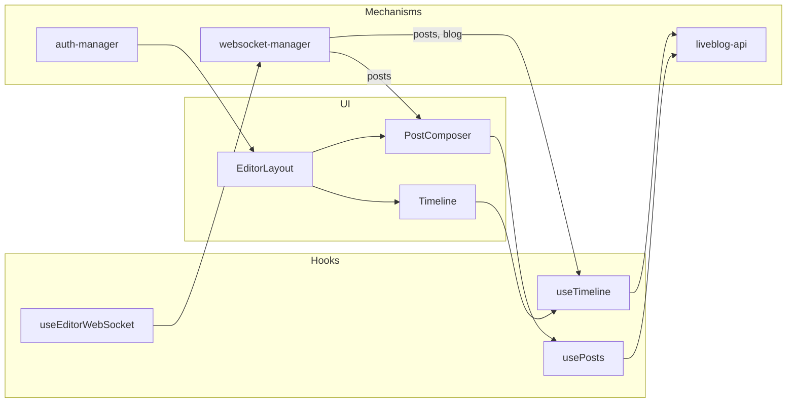

# Editor Manager

Blog editor and settings for Liveblog admin — timeline, post composer, embeds, polls, and blog configuration. For change history and file lists, see [CHANGELOG.md](CHANGELOG.md).

## Overview

The largest legacy admin module (`liveblog-edit`), ported to React. Covers the editor shell, Sir Trevor–style post composer, paginated timeline, embed handlers, polls, freetype fields, syndication ingest panel, output channels, and the blog settings rail. Real-time updates arrive via **websocket-manager**; all REST I/O via **liveblog-api**.

## Status

**Phase 4 complete (2026-05-26)** — embed-handlers, polls, blog-settings-rail, output-modal. **WebSocket live (2026-05-26):** `useEditorWebSocket` (T-edit-13, T-edit-14). **Blogging UX (2026-05-27):** schedule, edit/cancel, unpublish, image block, freetype composer (T-edit-15), Scorecard builtin (T-edit-23). **Rich text composer (2026-05-27):** Maroela-style toolbar via `rich-text-editor` subsystem (T-edit-24, T-edit-25). **Webhook-gated composer (2026-06-17):** optional custom title vs title+featured image based on blog webhooks; shared media library.

## Purpose

- Port `/liveblog/edit/:id` and `/liveblog/settings/:id` from legacy Superdesk activities to React Router
- Compose, edit, publish, schedule, reorder, and delete posts on a live timeline
- Manage drafts, contributions, scheduled posts, comments, and syndication ingest queues
- Render Sir Trevor block types (Text, Image, Embed, Quote, Comment, Poll, Video) in a React composer; **Text/Quote** use rich HTML editor (Maroela parity)
- Resolve and display social/media embeds (Twitter, Facebook, Instagram, pictures, Iframely fallback)
- Create and edit polls attached to posts
- Render freetype template fields (scorecards, ads, custom theme fields)
- Configure blog settings: metadata, members, outputs, consumers, theme preferences
- Subscribe to WebSocket events for live timeline and blog updates
- Enforce auth and blog-level permissions via **auth-manager**
- Apply Maroela design tokens via **style-guide** (REQUIRED)

## Current Implementation

- **Legacy:** `client/app/scripts/liveblog-edit` — AngularJS module `liveblog.edit` (~76 files). Controllers: `blog-edit.js`, `blog-settings.js`. Services: `postsService`, `blogService`, `PagesManager`, `freetypeService`, `unreadPostsService`. Sir Trevor integration via `ng-sir-trevor` and `sir-trevor-blocks`. Embed handlers in `embed/handlers/`. React islands for polls, embeds, tags, date picker, inactivity modal.
- **Web2:** `client_web2/src/mechanisms/editor-manager/` — `EditorPage`, `SettingsPage` (tabbed rail), hooks, composer (rich Text, Image, Embed, Poll, freetype), timeline, view modes, live preview. See File Structure and [subsystem READMEs](subsystems/).

## Liveblog server / API

All HTTP via **liveblog-api** (no raw `fetch`). Base: `http://localhost:5000/api` (Vite proxy `/api`).

### REST resources (legacy `apiProvider` registrations)

| Resource | Legacy rel | Used for |
|----------|-------------|----------|
| `posts` | `posts` | CRUD, publish, unpublish, reorder, flag |
| `items` | `items` | Post item blocks (Sir Trevor output) |
| `polls` | `polls` | Poll create/update on posts |
| `archive` | `archive` | Archived post retrieval |
| `outputs` | *(global)* | Output channel CRUD (settings tab) |
| `consumers` | `consumers` | Consumer list for outputs |
| `blogs/:id/posts` | nested | Paginated post queries (Elasticsearch criteria) |
| `post_flags` | — | Collaborative edit flags |
| `themes` | `themes` | Theme settings in output modal / settings |
| `collections` | — | Output modal collection picker |
| `global_preferences` | `global_preferences` | Instance editor settings (tags, YouTube, quotation marks) |
| `users`, `languages`, `request_membership` | — | Settings: members, locale, membership requests |

### WebSocket events (via **websocket-manager**)

| Event | Legacy constant | Purpose |
|-------|-----------------|---------|
| `posts` | `EventNames.Posts` | New/updated/deleted posts; syndication ingest; unread counters |
| `blog` | `EventNames.Blog` | Blog publish, public URL updates, limit changes |
| `embed_generation_error` | `EventNames.EmbedGenerationError` | Theme embed generation failure (throttled notify) |
| `removing_timeline_post` | `EventNames.RemoveTimelinePost` | Post removed from open timeline (posts limit rollover) |

Additional legacy scope events consumed in editor: `posts:updateFlag`, `posts:deletedFlag`, `blog:limits`.

## Dependencies

- **liveblog-api** (REQUIRED) — posts, items, polls, archive, outputs, consumers, blogs
- **websocket-manager** (REQUIRED) — Posts, Blog, EmbedGenerationError, RemoveTimelinePost
- **auth-manager** (REQUIRED) — session, blog-level permission checks
- **request-logger** — all HTTP logged via liveblog-api
- **style-guide** (REQUIRED) — Maroela tokens, editor chrome, timeline, settings UI
- **navigation-manager** — shell chrome, back-to-list navigation

## Dependents

- **syndication-manager** — ingest panel integration (Phase 4+)
- **analytics-manager** — link from editor subnav to `/liveblog/analytics/:id` (separate mechanism)
- **freetypes-manager** — freetype template definitions (Phase 6; editor consumes rendered fields)

## Technical Specification

### Routes

| React Router path | Legacy activity | View |
|-------------------|-----------------|------|
| `/liveblog/edit/:id` | `/liveblog/edit/:_id` | Editor + timeline + composer |
| `/liveblog/settings/:id` | `/liveblog/settings/:_id` | Blog settings rail |

Both routes resolve the blog by `:id`; 404 redirects to `/liveblog` (blog list).

### Core types

```typescript
interface PostItem {
  _id?: string;
  item_type: 'text' | 'embed' | 'comment' | 'poll' | 'video' | string;
  text?: string;
  meta?: Record<string, unknown>;
  commenter?: string;
  user?: LiveblogUser;
}

interface PostGroup {
  id: string;
  refs: Array<{ item: PostItem }>;
}

interface Post {
  _id: string;
  blog: string;
  post_status: 'open' | 'draft' | 'comment' | string;
  published_date?: string;
  content_updated_date?: string;
  scheduled?: boolean;
  sticky?: boolean;
  lb_highlight?: boolean;
  deleted?: boolean;
  order?: number;
  edit_flag?: PostFlag | null;
  syndication_in?: string;
  producer_blog_title?: string;
  original_creator?: LiveblogUser;
  groups: PostGroup[];
  /** Derived by posts service */
  mainItem?: { item: PostItem };
  items?: Array<{ item: PostItem }>;
  multipleItems?: number | false;
  hasComments?: boolean;
  showUpdate?: boolean;
}

interface BlogMember {
  user: string;
  role?: string;
}

interface BlogPreferences {
  theme?: { _id: string; name?: string; settings?: Record<string, unknown> };
  last_scorecard?: Record<string, unknown>;
  [key: string]: unknown;
}

interface Blog {
  _id: string;
  title: string;
  blog_status: 'open' | 'closed' | string;
  description?: string;
  language?: string;
  public_url?: string;
  public_urls?: string[];
  total_posts: number;
  posts_limit: number;
  original_creator: string;
  members?: BlogMember[];
  blog_preferences: BlogPreferences;
  users_can_comment?: 'enabled' | 'disabled' | string;
}

interface PostFilters {
  sort?: string;
  status?: string;
  sticky?: boolean;
  authors?: string[];
  updatedAfter?: string;
  highlight?: boolean;
  excludeDeleted?: boolean;
  syndicationIn?: boolean;
  noSyndication?: boolean;
  scheduled?: boolean;
  maxPublishedDate?: string;
}

type EditorPanel =
  | 'editor'
  | 'timeline'
  | 'contributions'
  | 'scheduled'
  | 'drafts'
  | 'ingest'
  | 'incoming-syndication'
  | 'comments';

type TimelineSort =
  | 'editorial'
  | 'updated_first'
  | 'newest_first'
  | 'oldest_first'
  | 'editorial_asc';

interface TimelineState {
  blogId: string;
  panel: EditorPanel;
  status: string;
  sort: TimelineSort;
  sticky: boolean;
  highlight: boolean;
  noSyndication: boolean;
  scheduled: boolean;
  pages: Post[][];
  meta: { total: number; max_results: number; page: number };
  isLoading: boolean;
  reorderPost: Post | null;
  authors: string[];
}

interface PostFlag {
  _id: string;
  postId: string;
  user: string;
}

interface SirTrevorBlock {
  type: 'Text' | 'Image' | 'Embed' | 'Quote' | 'Comment' | 'Poll' | 'Video';
  data: Record<string, unknown>;
}

interface ComposerState {
  blocks: SirTrevorBlock[];
  sticky: boolean;
  highlight: boolean;
  scheduledDate: string | null;
  freetypeData: Record<string, unknown>;
  isDirty: boolean;
  currentPost: Post | null;
}
```

### Hooks and services

```typescript
// Timeline pagination (legacy PagesManager)
function useTimeline(blogId: string, options: Partial<TimelineState>): TimelineState & {
  fetchNextPage(): Promise<void>;
  fetchNewPage(): Promise<void>;
  addPost(post: Post): void;
  updatePost(post: Post): void;
  removePost(postId: string): void;
  changeOrder(sort: TimelineSort): Promise<void>;
  changeHighlight(highlight: boolean): Promise<void>;
  setAuthors(authors: string[]): Promise<void>;
  startReorder(post: Post): void;
  reorder(index: number, location: 'above' | 'below'): Promise<void>;
};

// Post CRUD (legacy postsService)
function usePosts(blogId: string): {
  savePost(post: Post, items: PostItem[], params?: Record<string, unknown>): Promise<Post>;
  saveDraft(post: Post, items: PostItem[], sticky: boolean, highlight: boolean): Promise<Post>;
  publishPost(postId: string): Promise<Post>;
  unpublishPost(postId: string): Promise<Post>;
  deletePost(postId: string): Promise<void>;
  flagPost(postId: string): Promise<PostFlag>;
  removeFlag(flag: PostFlag): Promise<void>;
};

// Blog (legacy blogService)
function useBlog(blogId: string): {
  blog: Blog | undefined;
  isLoading: boolean;
  updateBlog(patch: Partial<Blog>): Promise<Blog>;
  getPublicUrl(): Promise<string | undefined>;
};

// Real-time (websocket-manager)
function useEditorWebSocket(blogId: string, handlers: {
  onPosts(data: { posts: Post[]; scheduled_done?: boolean }): void;
  onBlog(data: { blog_id: string; published?: number; public_url?: string }): void;
  onEmbedError(data: { blog_id: string; error: string; theme_name?: string }): void;
  onRemoveTimelinePost(data: { post_id: string }): void;
}): void;

// Composer
function usePostComposer(blog: Blog): ComposerState & {
  loadPost(post: Post | null): void;
  addBlock(type: SirTrevorBlock['type']): void;
  removeBlock(index: number): void;
  updateBlock(index: number, data: Record<string, unknown>): void;
  submit(): Promise<void>;
  saveDraft(): Promise<void>;
  reset(): void;
  canSubmit: boolean;
};
```

### Sir Trevor block parity

Legacy `SirTrevorOptions` block types: **Text**, **Image**, **Embed**, **Quote**, **Comment**, **Poll**, **Video**. Default block: Text. Transform: block → `{ type, text, meta }` for API items. Composer disables submit until content is dirty (legacy `disableSubmit` behaviour).

### Rich text (Text / Quote blocks)

| Concern | Implementation |
|---------|----------------|
| Editor UI | `subsystems/rich-text-editor/RichTextBlockEditor.tsx` — `contentEditable` + toolbar (`execCommand`) |
| Storage | `block.data.text` → `PostItem.text` as HTML string |
| Empty detection | `normalizeRichTextHtml` / `blockTextValue` in `blockTransform.ts` |
| Display | `isRichTextHtml(text)` → `EmbedHtml` in `PostCard`, `PreviewPostItem`, `ThemedPostCard` |
| Reference UX | Maroela `article-editor-manager/ArticleFieldsForm.tsx` |

See [subsystems/rich-text-editor/README.md](subsystems/rich-text-editor/README.md).

### Post lifecycle (2026-05-27)

| Feature | Hook / service |
|---------|----------------|
| Schedule | `composerSchedule.ts` — `published_date`, `scheduled` on save |
| Edit mode | `usePostComposer.loadPost`, banner + cancel in `PostComposer` |
| Unpublish | `usePosts.unpublishPost` — `open` → `draft` |
| Image block | `blockTransform` `item_type: 'image'`, URL in composer |

### Webhook-gated title & featured image (2026-06-17)

| Blog webhooks | Composer UI | Save behaviour |
|---------------|-------------|----------------|
| **None** | Checkbox “Voeg pasgemaakte titel by”; title field only when checked | `show_headline` + `headline` when opted in; no featured image |
| **One or more enabled** (blog-specific or global) | **Pasgemaakte titel** + optional **Hoofbeeld** picker | `headline` always; featured image optional (`none` default); `show_headline` false |

- Detection: `useBlogHasWebhook` → `blogWebhooks.ts` (`webhookAppliesToBlog` matches `blog_id` or all-blogs hooks).
- Cache: React Query key `['webhooks', 'blog', blogId]`; invalidated from **integrations-manager** on webhook save/remove (`invalidateWebhookQueries`).
- Featured image library: `GET /api/media_pictures` (all editors, paginated via `listAllMediaPictures`); broken renditions filtered server- and client-side.

## File Structure

The mechanism is implemented by the following paths (under `client_web2/src/`):

```
mechanisms/editor-manager/
├── index.ts                              # Public exports
├── types.ts                              # EditorPanel, ComposerState, SirTrevorBlock
├── routes/
│   ├── EditorPage.tsx                    # /liveblog/edit/:id — view modes, composer, timeline
│   └── SettingsPage.tsx                  # /liveblog/settings/:id — settings rail
├── hooks/
│   ├── useBlog.ts                        # getBlog + PATCH via liveblog-api
│   ├── useBlogSettings.ts                # Members, outputs, consumers settings
│   ├── useTimeline.ts                    # PagesManager-style pagination
│   ├── usePosts.ts                       # save/publish/unpublish/delete via liveblog-api
│   ├── usePostComposer.ts                # Blocks, freetype mode, schedule, edit
│   └── useEditorWebSocket.ts             # useWsEvent: posts, blog, embed error, timeline remove
├── services/
│   ├── blockTransform.ts                 # Sir Trevor blocks ↔ PostItem (+ HTML text)
│   ├── blockTransform.test.ts
│   ├── blockTransform.richText.test.ts
│   ├── composerSchedule.ts               # Schedule publish datetime
│   ├── composerPreview.ts                # Draft preview helpers
│   └── themeAssets.ts                    # Theme CSS URLs for preview
├── components/
│   ├── EditorLayout.tsx                  # Chrome, rail, panels
│   ├── EditorViewModeSwitch.tsx          # edit / split / preview
│   ├── PostComposer.tsx                  # Rich text, Image, Embed, Poll, freetype
│   ├── BlogLivePreviewPane.tsx           # Device preview + live posts
│   ├── PreviewPostItem.tsx               # Reader-style block render
│   ├── Timeline.tsx                      # Post list + load more
│   ├── PostCard.tsx                      # Timeline card + unpublish
│   └── ThemedPostCard.tsx                # Themed preview card
└── subsystems/
    ├── rich-text-editor/
    │   ├── index.ts
    │   ├── RichTextBlockEditor.tsx       # Maroela-style toolbar + contentEditable
    │   ├── richTextHtml.ts
    │   └── richTextHtml.test.ts
    ├── embed-handlers/
    │   ├── index.ts
    │   ├── detectProvider.ts
    │   ├── components/EmbedHtml.tsx      # HTML render (text + embeds)
    │   └── …
    ├── polls/
    │   ├── PollBlockEditor.tsx
    │   └── pollCalculations.ts
    ├── freetype-fields/
    │   ├── FreetypeFields.tsx            # Post type + template fields
    │   └── FreetypeFieldInput.tsx
    ├── output-modal/
    └── blog-settings-rail/
```

**Deferred (not yet in tree):** `EditorProvider`, `useUnreadCounts`, `posts-timeline/TimelineReorder`, full Iframely/social handler modules — see open tasks.

## Design Decisions

- **No raw fetch or WebSocket** — all I/O through **liveblog-api** and **websocket-manager** with **request-logger**
- **Sir Trevor parity first** — block types and item transform match legacy; Text blocks store HTML like legacy Sir Trevor output
- **Rich text via execCommand** — same approach as Maroela article editor; no TipTap dependency in liveblog admin
- **PagesManager as hook** — `useTimeline` + `usePagesManager` preserve infinite-scroll page stacking and sort/filter semantics
- **Subsystem boundaries** — Phase 4 subsystems under `subsystems/`; source-of-truth file list is this README File Structure (no per-subsystem plan READMEs yet)
- **Settings co-located** — `/liveblog/settings/:id` lives in editor-manager (legacy `BlogSettingsController`) not settings-manager (instance-level)
- **Embed throttling** — `EmbedGenerationError` notifications throttled ~3 h via localStorage (legacy `Storage.write` behaviour)
- **Collaborative flags** — post edit flags via `post_flags` API; WS `posts:updateFlag` / `posts:deletedFlag` keep multiple editors in sync
- **Style-guide mandatory** — editor chrome classes (`m-portal-editor`, `m-editor-rail`) ported to Tailwind tokens in style-guide

## Implementation Approach

Phase 3–4 per [plans/README.md](../../README.md#implementation-phases).

1. **Phase 3 — Scaffold** — types, routes, `EditorLayout`; `useTimeline`, composer, timeline; smoke `smoke-editor.mjs`
2. **Phase 3 — Panels** — rail switches open/drafts/contributions/scheduled/comments timelines
3. **Phase 4 — Subsystems** — embed-handlers, polls, freetype-fields (stub), blog-settings-rail, output-modal; smoke `smoke-editor-phase4.mjs`
4. ~~**WebSocket**~~ — done via websocket-manager (T-edit-13, T-edit-14); posts debounced 400ms
5. **Phase 6 — Syndication ingest** — ingest panel when syndication-manager available
6. **Tests** — Vitest per subsystem + mechanism smokes on Docker :5000; reports under `plans/reports/tests/editor-manager/`

## Subsystems

| Subsystem | Plan README | Legacy source | Responsibility |
|-----------|-------------|---------------|----------------|
| **posts-timeline** | — (core hooks) | `pages-manager.service.ts`, `posts-list` | Paginated timeline, panels, `PostCard` |
| **post-composer** | — (core components) | `ng-sir-trevor`, `blog-edit.js` | Sir Trevor blocks, publish/draft, sticky/highlight |
| **embed-handlers** | [README](subsystems/embed-handlers/README.md) | `embed/handlers/*`, `helpers.ts` | URL provider detection; composer preview (**Iframely not wired**) |
| **polls** | [README](subsystems/polls/README.md) | `components/polls/*` | Poll block; `savePollForPost` via liveblog-api |
| **rich-text-editor** | [README](subsystems/rich-text-editor/README.md) | Maroela `ArticleFieldsForm` | Text/Quote HTML composer toolbar |
| **freetype-fields** | [README](subsystems/freetype-fields/README.md) | `freetype.service.js` | Post type + freetype template fields |
| **output-modal** | [README](subsystems/output-modal/README.md) | `output-modal.js`, embed code views | Output CRUD + embed snippet modal |
| **blog-settings-rail** | [README](subsystems/blog-settings-rail/README.md) | `blog-settings.js`, `settings.ng1` | General, team, outputs, consumers tabs |

## Components

All components use **style-guide** tokens (`page`, `teal`, `orange`, Lato). Legacy SCSS references: `liveblog-edit/styles/*.scss`, `portal.css` editor chrome.

### EditorLayout

- **Purpose:** Top subnav (back, title, analytics/settings links) + left side rail (panel buttons) + two-column editor/timeline layout
- **Location:** `components/EditorLayout.tsx`
- **Props:** `{ blog: Blog; panel: EditorPanel; onPanelChange(panel: EditorPanel): void; children: ReactNode }`
- **Styling:** `m-portal-chrome`, `m-editor-chrome`, `m-editor-rail`, `m-portal-editor` equivalents from style-guide

### Timeline

- **Purpose:** Infinite-scroll list of `PostCard` for current panel (open, drafts, contributions, etc.)
- **Location:** `components/Timeline.tsx`
- **Props:** `{ timeline: TimelineState; onPostSelect(post: Post): void; onReorder?: ReorderHandlers }`
- **Styling:** Timeline borders, flicker on WS refresh, loading indicator

### PostComposer

- **Purpose:** Sir Trevor block editor (rich Text, Image, Embed, Poll), freetype mode, publish/draft/schedule, sticky/highlight
- **Location:** `components/PostComposer.tsx`
- **Props:** `PostComposerProps` — `composer`, `isFreetypeMode`, `isEditing`, `scheduledDatetimeLocal`, block callbacks
- **Rich text:** `RichTextBlockEditor` for Text/Quote; no duplicate “Inhoud” label on default single text block
- **Styling:** `.m-editor-composer__*`, `.m-rich-text-editor__*` in `index.css`

### PostCard

- **Purpose:** Single post in timeline — metadata, actions (edit, delete, unpublish, reorder), unread badge
- **Location:** `components/PostCard.tsx`
- **Props:** `{ post: Post; allowEditing: boolean; allowDeleting: boolean; allowReordering: boolean; onEdit(): void; onDelete(): void }`
- **Styling:** `lb-post__*` card layout, producer label, scheduled label

### SettingsRail (Phase 4)

- **Purpose:** Vertical tab navigation for blog settings
- **Location:** `subsystems/blog-settings-rail/SettingsRail.tsx`
- **Props:** `{ tab: SettingsTab; onTabChange; children }`

### GeneralSettings / MembersSettings / OutputsTab / ConsumersList (Phase 4)

- **Purpose:** Tab panels for metadata, team PATCH, output list, consumer tag settings
- **Location:** `subsystems/blog-settings-rail/`
- **Data:** `useBlogSettings` hook + liveblog-api

### OutputModal / OutputEmbedCodeModal (Phase 4)

- **Purpose:** Output channel form; copy iframe embed for `blog.public_urls.output[id]`
- **Location:** `subsystems/output-modal/`

### PollBlockEditor / EmbedPreview / FreetypeFields (Phase 4)

- **Purpose:** Poll composer block; embed URL preview; freetype stub slot
- **Location:** `subsystems/polls/`, `embed-handlers/`, `freetype-fields/`

## Usage Examples

```tsx
import { EditorPage, SettingsPage } from '@/mechanisms/editor-manager';

// App router (navigation-manager shell)
<Route path="/liveblog/edit/:id" element={<EditorPage />} />
<Route path="/liveblog/settings/:id" element={<SettingsPage />} />
```

```tsx
import { useTimeline, usePostComposer, PostComposer, Timeline } from '@/mechanisms/editor-manager';

function EditorPanel({ blog }: { blog: Blog }) {
  const timeline = useTimeline(blog._id, { status: 'open', sort: 'editorial' });
  const composer = usePostComposer(blog);

  return (
    <>
      <PostComposer blog={blog} composer={composer} onSubmit={composer.submit} />
      <Timeline
        timeline={timeline}
        onPostSelect={(post) => composer.loadPost(post)}
      />
    </>
  );
}
```

```tsx
import { useEditorWebSocket } from '@/mechanisms/editor-manager';

useEditorWebSocket(blogId, {
  onPosts: ({ posts }) => timeline.addPost(posts[0]),
  onRemoveTimelinePost: ({ post_id }) => timeline.removePost(post_id),
  onEmbedError: ({ error }) => notify.error(error),
  onBlog: (data) => blogQuery.refetch(),
});
```

## Data Flow



**Publish flow:** Composer blocks → `usePosts.savePost` → `liveblog-api` POST/PATCH items + post → timeline `fetchNewPage` or WS `posts` event inserts card.

**Settings flow:** SettingsPage → `useBlog.update` → PATCH blog → outputs/consumers via separate API calls; WS `blog` updates public URL.

## Error Handling Strategy

| Failure | Behaviour |
|---------|-----------|
| Blog 404 on route resolve | Toast error; redirect to `/liveblog` |
| API 4xx/5xx | liveblog-api normalizes error; toast via app notify; request-logger captures payload |
| WS disconnect | websocket-manager reconnect; timeline shows stale badge until resync |
| EmbedGenerationError | Throttled error toast (~3 h per blog); logged |
| Posts limit exceeded | Confirm modal before publish (legacy `doOrAskBeforeIfExceedsPostsLimit`) |
| Edit flag conflict | Show flag holder; block edit until flag cleared or timeout |
| Embed URL unresolved | Fall back to Iframely; show inline error in Embed block |

## Related Mechanisms

- [liveblog-api](../liveblog-api/README.md) — REST client
- [websocket-manager](../websocket-manager/README.md) — WAMP/WebSocket
- [auth-manager](../auth-manager/README.md) — login, session, blog permissions
- [blog-list-manager](../blog-list-manager/README.md) — entry point; back navigation
- [navigation-manager](../navigation-manager/README.md) — app shell, subnav
- [style-guide](../style-guide/README.md) — Maroela tokens and editor chrome
- [syndication-manager](../syndication-manager/README.md) — ingest panel (Phase 6)
- [freetypes-manager](../freetypes-manager/README.md) — freetype template definitions (Phase 6)

## Testing Requirements

| Level | Scope |
|-------|-------|
| **L1 — Unit** | `usePagesManager` page stacking; post filter criteria builder; Sir Trevor block transform; embed handler URL matching; poll utils |
| **L2 — Integration** | `usePosts` + mocked liveblog-api; `useEditorWebSocket` event handlers updating timeline state; composer submit → API payload shape |
| **L3 — Smoke (Docker)** | `smoke-editor.mjs` (Phase 3); `smoke-editor-phase4.mjs` (outputs, consumers, collections, poll); manual UI at :9001 |

**Smoke scripts:** `client_web2/scripts/smoke-editor.mjs`, `smoke-editor-phase4.mjs`

**Test report:** `plans/reports/tests/editor-manager/2026-05-26/` (test-summary.md, test-results.json)

All external calls must appear in request-logger output. WS events must be logged by websocket-manager when T-edit-13 is done.

## Legacy reference

`client/app/scripts/liveblog-edit`

Key entry files:

| File | Role |
|------|------|
| `module.js` | Routes, API registrations, Sir Trevor config |
| `index.js` | Service/module wiring |
| `controllers/blog-edit.js` | Editor controller (~1100 lines) |
| `controllers/blog-settings.js` | Settings controller |
| `posts.service.ts` | Post CRUD, flags, Elasticsearch queries |
| `blog.service.js` | Blog get/update, public URL, embed errors |
| `pages-manager.service.ts` | Timeline pagination |
| `freetype.service.js` | Freetype template rendering |
| `unread.posts.service.js` | WS-driven unread counters |
| `directives/output-modal.js` | Output channel modal |
| `embed/handlers/` | Social embed handlers |

## Tasks

See [TASKS.md](TASKS.md) for implementation tasks.
